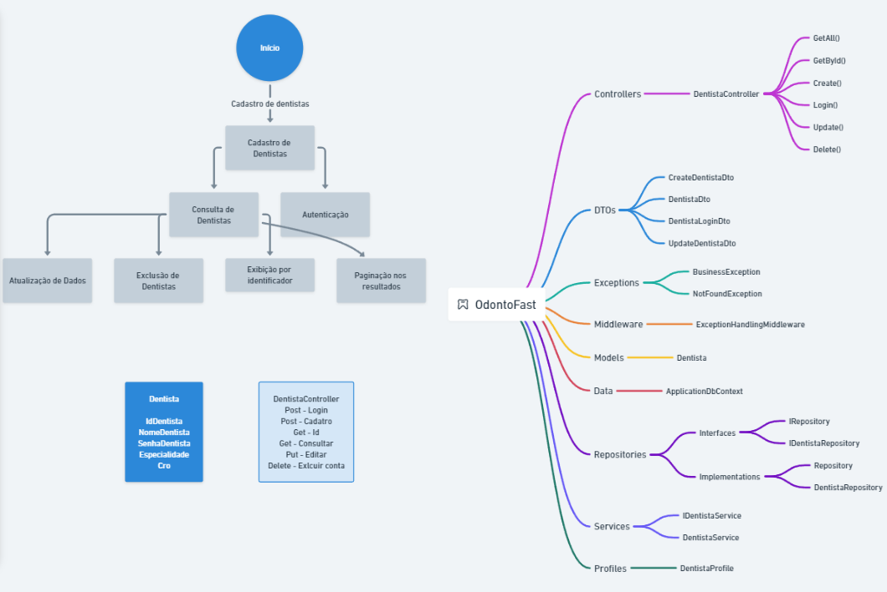

# OdontoFast
## **Turma, Integrantes do Grupo & RM**  
   - **Turma**: 2TDSPS

   - **Felipe Amador/RM:553528**
   - **Sara Sousa/RM:552656**
   - **Leonardo Oliveira/RM:554024**

## Definição do Projeto

### Objetivo do Projeto
A OdontoFast website é uma aplicação que será usada por dentistas visando, futuramente, facilitar o agendamento de consultas, detalhamento de tratamento e a gestão de informações dos pacientes por meio do consumo de uma API, que será obtida através da aplicação Mobile OdontoFast para pacientes. O projeto em .NET pretende resolver a dificuldade que pacientes e dentistas enfrentam na comunicação, seja nos detalhes de tratamentos preventivos, quanto no agendamento de consultas e ciência dos cuidados e hábitos dos pacientes, promovendo um sistema eficiente e organizado.

### Escopo
O projeto, até o momento, inclui o desenvolvimento de uma API RESTful que permite:
- Cadastro de dentistas.
- Consulta de informações dos dentistas.
- Atualização dos dados dos dentistas.
- Implementação de autenticação para dentistas.
- Paginação nos resultados das consultas.

**Desenho da Arquitetura:**

### Escopo a ser desenvolvido
- Preparação e implementação do consumo da API da Aplicação Mobile nas camadas e ajustes conforme os conceitos de arquitetura limpa.

### Requisitos Funcionais
1. **Cadastro de Dentistas:** O sistema permite que novos dentistas sejam cadastrados com informações como nome, senha, especialidade e CRO.
2. **Consulta de Dentistas:** O sistema oferece a funcionalidade de consultar os dentistas cadastrados.
3. **Atualização de Dados:** O sistema permite que os dentistas atualizem suas informações.
4. **Exclusão de Dentistas:** O sistema permite a remoção de dentistas.
5. **Autenticação:** O sistema possibilita que dentistas façam login utilizando suas credenciais.

### Requisitos Não Funcionais
1. **Escalabilidade:** A arquitetura deve permitir a adição de novas funcionalidades com facilidade.
2. **Usabilidade:** A API é fácil de usar e bem documentada para desenvolvedores que desejam integrá-la em suas aplicações.
3. **Documentação:** Código bem documentado, e a API tem uma documentação acessível.

## Tecnologias Utilizadas
- **ASP.NET Core**: Framework para desenvolvimento da API.
- **Entity Framework Core**: ORM utilizado para interagir com o banco de dados.
- **Oracle Database**: Banco de dados utilizado para persistência de dados.
- **AutoMapper**: Biblioteca para mapeamento de objetos.
- **Swagger**: Ferramenta para documentação da API.

## Como Executar o Projeto
1. Clone o repositório.
2. Abra o projeto.
3. No PowerShell do Desenvolvedor, digite o comando: 'dotnet watch run'.
4. Abrirá automaticamente no seu navegador a documentação de API Swagger, com as estruturas dos endpoints para teste.

## Contribuição
Contribuições são bem-vindas! Sinta-se à vontade para abrir issues ou enviar pull requests.

## Licença
Este projeto está licenciado sob a [MIT License](LICENSE).
